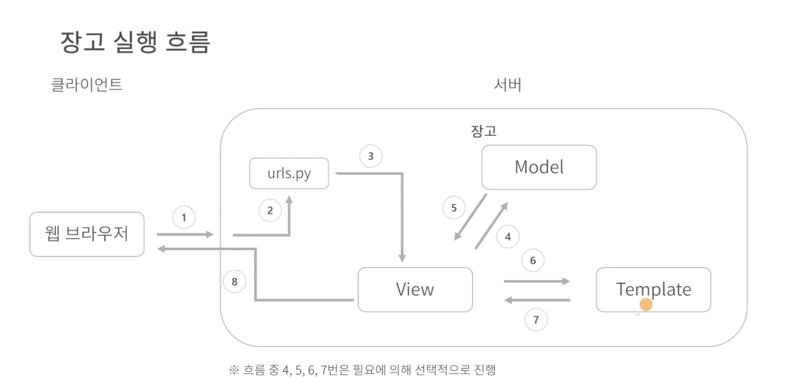

# Django 요약

## 백엔드 개발 기초

**웹의 동작 원리**

 사용자 ↔ 브라우져 (클라이언트),(사용자 입력제공,출력) ↔ 서버(로직,연산 수행, DB관리 수행 ↔ 데이터베이스 (서버)

클라이언트 : 요청을 보냄, 서버 : 응답을 함 (클라, 서버 둘 다 역할임)

**프론트 vs 백엔드**

프론트 : 사용자 인터페이스, 사용자 입력, 데이터 출력

백엔드 : 시스템 관리 및 제어, 비즈니스 로직/연산 수행, 데이터베이스 관리

- 상황, 목적에 맞게 프레임워크와 언어를 취사 선택함

요청 → 응답 → 요청 → 응답 의 흐름으로 볼 수 있어야 함

**포기하지 않고 문제를 해결하는 마인드를 가져야 함**

**프레임워크 : 프레임 + 워크,**

- 소프트웨어 개발을 위한 기능, 구조의 틀을 제공
- 시스템 흐름을 프레임워크가 제어함

**라이브러리**

- 소프트웨어 개발을 위한 기능을 제공
- 시스템 흐름을 개발자가 제어함

둘 다 코드의 집합체들임

**프레임워크의 장점**

- 효율적 : 이미 코드가 구현되어 있어 시간과 비용 절약, 생산성이 높음
- 품질 향상 : 수많은 개발자들이 검증한 코드로 버그를 최소화
- 유지보수 용이 : 체계적인 코드관리로 유지보수 용이, 프레임워크 기준 개발로 협업 수월

**프레임워크의 단점**

- 프로그래밍 언어 외 별도 학습 필요
- 기본 설계 구조 사용하기 때문에 개발이 다소 제한적

*프레임워크는 개발에 필수적*

쟝고는 굉장히 많이 이미 정해져있음 → 학습하기 수월, 전체적인 웹서비스를 만들때 유용

**쟝고의 기능**

- 세션 관리, 응답 생성, 비즈니스 로직, 로그인/로그아웃 처리, 관리자 페이지, 데이터 정의, 데이터베이스 처리, URL 파싱, 요청 파싱

**쟝고를 사용하는 서비스**

- 인스타, 핀터레스트, 나사, 레딧, 유튜브, 토스, 번개장터, 코인빗 등등
- **쟝고**
    
    **슬로건** : 마감시간이 있는 완벽주의자를 위한 웹 프레임워크 → 완성도 높이고, 개발 빠르게 해줌
    
    **쓰는 이유?**
    
    - 개발 속도 빠름, 학습 쉬움
    - 기본적으로 필요한 기능 제공 (ORM, Admin, Templates … )
    - 인증, 보안 부분도 고려해줌
    - 풀스택 프레임워크
    
    **특징**
    
    - 파이썬 웹 프레임워크
    - MTV(Model Template View) 디자인 패턴
    - 오픈 소스
    - 앱 단위 프로젝트 구성
    
    **앱이란?** 
    
    - 장고 프로젝트를 구성하는 모듈
    - 장고 프로젝트 관점에서 관련되 기능을 모아둔 파이썬 파일
    - 앱 이름은 영문 복수형으로 생성
    
    **장고 핵심 요소**
    
    - ORM(Object-Relational Mapping) : 객체와 관계형 DB를 연결해주는 기술 (Models,QuerySet API 등)
    - Templates : HTML 파일에 include,if,for 등 템플릿 언어 사용 가능 → 디자인과 로직 분리해 독립적 개발 가능 / HTML 파일을 분리해 재사용, 관리 가능
    - Forms : 입력받은 데이터의 **유효성 검사**, 구성하고자 하는 형태 렌더링(HTML 태그 생성), 제출하는 폼 데이터의 변경 확인
    - Authentication : 시스템 인증과 권한부여 기본 제공, 구성요소(사용자,권한,그룹)
        
        (인증 : 사용자가 누군지 판별, 권한 : 인증된 사용자가 어떤 일을 할 수 있는지 결정)
        
    - **Admin** : 관리자 인터페이스 제공 → 등록된 모델의 기본적인 CRUD 제공
    - Internationalization : 동일한 소스코드로 다국어 환경 제공, 특정 사용자의 기본 설정 따라 현지화
    - Security : 대표적인 보안사항 기능 제공 (CSRF 보호, SQL 주입 보호 등)
    
    **MTV(Model Template View)**
    
    디자인 패턴
    
    - Model : 데이터 관리, db와 연결 및 실행  (models.py)
    - Template : 데이터 출력, 사용자에게 데이터 표현 방식 정의  (html)
    - View : 컨트롤러, 비즈니스 로직을 처리  (view.py)
    
    클라이언트 → 요청 → View → template(출력), model(관리) 에 시킴 → 응답 → 클라이언트
    
    이런 구조를 취하기 때문에 유지보수에도 용이
    
    
    
    웹 브라우져 → [urls.py](http://urls.py) → View → Model → View → Template → View → 웹 브라우져
    
    **장고 설치**
    
    1. 가상환경 설치 : python -m venv 가상환경명
    2. 장고 설치 : pip install django
    3. 장고 프로젝트 생성 : django-admin startproject config .
    4. 장고 서버 실행 : python3 [manage.py](http://manage.py) runserver
    
    **장고 기본 로직 : URLs & Views**
    
    - root 디렉토리
        
        [manage.py](http://manage.py) : 장고에 명령어 쓸 수 있도록 하는 파이썬 파일 (건들진 않음)
        
        config 파일
        
        명령어로 만들어진 파일들은 이름 바꾸기 X
        
    - config 파일
        
        __**init**__.py : config가 파이썬 패키지라고 선언해주는 약속
        
        asgi, wsgi.py : 배포(공개)할때 필요함 
        
        [settings.py](http://settings.py) : 장고가 실행될때 필요한 설정 값들이 들어감 (중요!)
        
        [urls.py](http://urls.py) : url 패스 안에 정의가 되어야 View에서 쓸 수 있음
        
    - **사칙연산 앱 만들기(실습)**
        1. 앱 생성 : django-admin startapp demos
        - 앱 생성 때 생기는 파일들
            
            migrations : DB 만들때 기록을 남김
            
            admin : 코드 작성하면 관리자 인터페이스 제공
            
            apps : 앱의 이름 등 설정값
            
            models : 저장해줘야하는 데이터들 작성
            
            tests : 테스트 코드를 짤 수 있는 곳
            
            views : 기능에 대한 실질적인 작동하는 코드를 작성하는 곳
            
        1. 앱을 settings에 추가해줌 → installed apps 에 추가
        2. views 에 기능 작성 : 기능, 요청을 처리하는 함수를 만들때 첫 인자로 무조건 request 와야 함
            
            →따로 템플릿 사용 안하고 httpresponse 통해서 텍스트로 응답
            
        3. 메인 urls 에 패스를 설정해줘야 함수를 실행 가능
            
            → 다른 파이썬 파일에 함수 설정했으니 demos에서 가져온다고 선언해줘야 함
            
        4. 더 잘 만드려면 html 파일을 따로 만들어서 연결 해줌(templates폴더 만듦, 안에 calculator.html)
        
        → views에 함수에 render(request, ‘html의 이름’) 으로 템플릿 넘겨줌
        
        1. calculator 함수가 request.Get 을 통해 사용자에게서 값(숫자,숫자,연산자)을 넘겨받게 해줌
        2. 넘겨받은 값에 따라 계산을 해서 결과를 변수 result 에 저장
        3. html에서 form문을 통해 값을 입력할 수 있게 함
        4. return의 render에 딕셔너리로 result라는 키로 result 값을 넘겨줌 → html에서 쓸 수 있게 됨
        5. html에서 result를 사용해 결과값 표시
        6. 사용성을 위해 이런저런 편의 추가 (입력 순서 등등)
    
    **HTTP기본 : Request & Response**
    
    HTTP : 컴퓨터가 서로 데이터를 주고 받는 방법, 리소스들을 가져올 수 있도록 해주는 프로토콜
    
    쟝고에서 req, rep를 어떻게 취급하는지 공식 홈페이지를 통해 알아보면 좋음
    
    미들웨어 라는 것이 사이에 껴서 리퀘스트.usr 통해서 사용자 인증, 권한 등 컨트롤하기 좋음
    
    디버깅 설정
    

## 데이터베이스와 ORM

**데이터베이스** : 공유의 목적으로 통합 관리되는 자료의 집합

→ 논리적으로 연관된 하나 이상의 자료모음으로 구조화하여 검색과 갱신을 효율화 함

**특징**

- 실시간 접근성 : 사용자의 요구를 즉시 처리 가능
- 지속적인 변화 : 정확한 값 유지 위해 삽입,삭제,수정 작업등을 이용해 데이터를 지속적으로 갱신 가능
- 동시 공유 : 여러 사람이 동일한 데이터에 접근하고 이용 가능
- 내용에 대한 참조 : 위치,주소가 아닌 데이터 값에 따라 참조 할 수 있어야 함

**관리 시스템 (DBMS)**

- 데이터베이스 내의 데이터를 접근 할 수 있도록 해주는 소프트웨어
- 사용자 or 다른 프로그램의 요구를 처리하고 응답해 데이터 사용할수 있도록 함
- 장점 : 중복 최소화, 데이터 독립성, 동시공유, 보안 향상, 무결성 유지, 장애 발생 시 회복 가능
- 단점 : 비용이 많이 발생, 백업 & 회복 방법이 복잡, 중앙 집중 관리로 인한 취약점 존재
- 기능
    - 정의 : 데이터베이스에 저장될 데이터 형과 구조에 대한 정의, 이용방식, 조건 등을 명시
    - 조작 : 데이터 검색,갱신,삽입,삭제 등을 체계적으로 처리 위해 사용자와 데이터베이스 사이의 인터페이스 수단을 제공
    - 제어 : 데이터베이스 접근 과정 중 데이터의 무결성이 유지되도록 제어
- 여러 데이터베이스 관리 시스템이 존재 (오라클, mysql, SQLite 등)

**테이블**

데이터베이스가 생긴 형태, 장고는 기본적인 사용자 테이블을 만들어줌

relation, Row(행), Collum(열), 목적에 맞게 테이블을 구분 → 다른 테이블에서 가져갈땐 고유식별자 이용

아이디값(고유식별자) 통해 중복을 최소화 할 수 있음

**구조적 질의 언어(SQL)**

- DDL : 데이터 정의 언어, 각 릴레이션을 정의하기 위한 언어
- DML : 데이터 조작 언어, 하나하나의 데이터를 조작하기 위한
- DCL : 데이터 제어 언어, 사용자의 접근 권한을 다루기 위한 언어

**ORM(Object Relational Mapping,객체-관계 매핑)**

객체지향 언어 ≠ 관계형 데이터베이스 → ORM이 필요함

객체 ↔ ORM ↔ 데이터베이스  이렇게 연결해줌

장점 : 생산성 향상, 비즈니스 로직 집중, 재사용 및 유지보수 용이, DBMS에 종속 X

단점 : 프로젝트가 복잡한 경우 난이도 상승, RawQuery보다 성능이 낮음

**장고 ORM**

- Model : 데이터베이스의 구조를 잡음
- Field : 데이터베이스의 구조를 잡음, 데이터형들 정의
- QuerySet API : 일부 쿼리를 날릴 수 있는걸 제공

**장고 Models**

데이터 관리, 데이터베이스에 저장할 테이블 정의, 모델에 작성된 코드 기준으로 데이터베이스 생성(ORM)

**모델 주요 필드**

CharField, TextField, BooleanField, DateTimeField, IntegerField, FloatField 등


**필드 주요 속성**

null, blank, choices, default, unique, verbose_name, max_length 등


새로운 테이블을 만들기 위해선 model을 건드려야 함

**인스타그램 게시글로 model 이해하기**

모델링 : 저장하고자 하는 데이터를 모델로 정의하는 것

ex) 프로젝트 라이언 모델링 하기

클래스 모델

- 클래스명, 클래스 요약, 수업시간, 학습기간, 난이도, 금액, 지원기간 등등으로 모델링 가능

모델링 하는 실력이 좋은 백엔드 개발자에게 꼭 필요함 (설계!)

멋사 인스타 게시글 모델링

- 이미지, 동영상, 게시한 사용자, 좋아요, 댓글, 조회수, 게시 시간, 내용 (내가해본 모델링)
- 이미지, 조회수, 좋아요 사용자, 내용, 댓글 (강의 모델링)

→ 파이썬 코드화 (Class Post)

- image - ImageField
- view_count - IntegerField
- content - TextField
- like_user - ManyToManyField
- comment - ForeignKey

공식 문서에서 Field 살피기 (모델링하고 어떻게 구현할지는 공식문서에서 살펴보면 됨)

- 생성일, 작성일 같은 히스토리 쫓아가는건 (AutoNowAdd만 잘 써주면 됨)
- 데이터 사이즈가 정해져있는건 사용할때 유의해야 함

**실습해보기**

- models 에 모델들을 작성 함 (장고의 모델 클래스를 상속)
- 마이그레이션(모델을 명세함) 함
    - makemigration → migrate
- 그러면 데이터베이스가 생성이 됨
- superuser를 만들어서 SQLite 설치 후 db.SQLite3 열어서 저장된거 확인 가능

**인스타 댓글로 알아보는 Model 관계 구성**

 **모델 관계**

- 1:1 (일대일)
- 1:N (일대다)
- N:M (다대다)

게시글과 댓글 관계 1:N

N이 되는 모델에 ForeignKey 사용 (댓글이 게시글을 참조 할 수 있도록)

게시글 모델 : 위에 설정한 모델

댓글 모델 : 게시글 ID(이게 ForeignKey), 내용

공식문서 참고해서 관계구성 함

on_delete : 어떤 모델을 참조할때 그 모델과의 관계나 어떻게 됐을때 내가 삭제가 될지 정함

- 인자로 속성을 정해서 삭제되는 방식을 정함(Protecet, Cascade 등)

사용자→게시글 (일대다), 게시글→댓글 (일대다)

**실습해보기**

1. 댓글 모델 만들기
    
    → post를 foreignkey로 받게 to, on_delete 등을 설정
    
    → 작성자를 나중에 User 커스텀해도 그대로 쓸수 있게 django의 get_user_model 써서 연동
    
2. post 모델 등 실습하기 편하게 설정 (null =True 등)
3. 다시 마이그레이션
4. 파이썬 인터프리터를 사용하여 데이터를 입력 할 수 있음 (아래처럼)


ForeignKey엔 to, on_delete는 필수로 설정해야함

## QuerySet API와 Admin 개발

모델과 QuerySet API가 ORM 역할을 해줌

Query : DB에 정보를 요청하는 것

QuerySet : DB에서 전달 받은 객체의 목록

QuerySet API : DB에 요청하기 위한 인터페이스

**Queryset API의 주요 함수**

새 쿼리셋을 반환하는 메서드

- filter() : n번 사용자가 쓴 데이터 조회
- exclude() : n번 사용자가 쓴거 제외하고 조회
- order_by() : 정렬
- select_related()
- prefetch_related()
- raw() : 직접 sql문 작성

쿼리셋 반환하지 않는 메서드

- get() : 테이블에 하나의 데이터만 뽑음
- create() : 데이터 추가
- count() : 특정 데이터의 수
- first() : 가장 첫번째 데이터
- last() : 마지막 데이터

**공식문서**를 확인하면 더 자세히 볼 수 있음 (ex. get_or_create() 같은 메서드도 있음)

**Django Shell**

파이썬 인터프리터 형식으로 장고 사용, Model을 import래서 사용 가능

python3 [manage.py](http://manage.py) shell ← 명령어로 사용 가능

**Database Tool**

데이터베이스에 관리를 위한 도구, 툴을 활용해 테이블or데이터 제작 (GUI 제공)

**실습해보기**

파이썬을 이용해 장고 사용함

1. 여러 객체들을 import 해옴 (Post, User, Comment)
2. Post에 쿼리셋API이용해서 내용 채움 (오류가 있음에 감사하다…)
3. for문 등 파이썬 문법을 이용해 데이터 출력도 가능
4. order_by에 - 를 붙이면 정렬 순서 반대로 설정 가능
5. 수정 후 save() 함수 이용해서 데이터베이스에 데이터 저장 가능

*Database Tool을 이용해 위의 내용들 실행 가능

**Admin 페이지**

1. 서버를 열고 어드민 페이지로 들어감 (admin, 12) → 그룹, 사용자등 제어 가능

→ 쟝고에서 제공해주는 기본 기능, urls 파일에 있는 /admin url로 가면 됨

엄청난 기능임, 권한, 접근, 데이터 등 다 제어 가능

[admin.py](http://admin.py) 파일에 코딩을 통해 admin 페이지에 모델 제어 추가 가능

**Admin 페이지 기본 구성하기**

1. model을 admin.py에 import 함
2. admin.site.register(모델) 통해서 사이트에 등록

→ 이후 데이터 추가, 수정 등등 가능 (기본적 CRUD 가능)

→ 여러 사람들이 이 페이지 사용 가능, 각 데이터에 따로따로 접근 권한을 부여 가능

**Admin 페이지 커스터마이징 하기**

admin.py에 클래스를 만들어 별도로 데이터를 필터, 검색 등의 기능을 할 수 있도록 커스텀 할 수 있음

1. class PostModelAdmin(admin.ModelAdmin) 클래스 를 만들고 
    
    @admin.register(Post) 이걸 연결 해줌
    
2. 안에 함수들을 원하는걸 커스텀 해줌 (튜플 형태로 해줌) (얘네도 공식문서 보면서 하면 됨)
    - list_display ← 볼때 안에 있는 요소들을 표시해서 보여줌
    - list_editable ← 직접 바깥에서 데이터를 수정할 수 있게 해줌
    - list_filter ← 필터를 지정해줌
    - list_search_fields ← 지정한 필드를 이용해 검색함
    - readonly_fields ← 수정하지 않는 데이터를 표시할 때 용이
3. 고급 커스텀 (게시글과 댓글 연동)
    - inlines 를 이용 - Inline class를 만들어서 인라인 클래스의 속성을 이용해 admin 페이지를 커스텀 할 수 있음
    - action[] 이용 - 함수를 만들어서 실행 할 수 있게 해줌
    
    이것저것 만져가면서 편의에 맞출 수 있음
    

**미션 : 로또 번호 추출기 구현**

**(문제)**

사용자가 웹 사이트에 접속하여 ‘로또 번호 추출하기 버튼을 클릭 시 [1,5,30,21,20,40,45] 형태의 로또 번호가 출력

(입력)

없음

(출력)

1. 로또 번호 7자리
2. 출력 화면

view 파일


html 파일


url 파일


실행 화면


**문제 2**

로또 번호 추출 결과 페이지 분리, 뽑고자 하는 게임 수 선택

views


urls


home.html


lotto.html


출력 화면


## Templat & View 정복

**Views를 만드는 두가지 방법**

 MTV 디자인 패턴, 장고 실행 흐름에 대해 잘 알고 있어야 함

View : 웹의 요청을 수신하고 응답하는 파이썬 **함수** 또는 **클래스**

- **FBV(Function Based View)**
    - 지금까지 했던 방식
    - 장점
        - 구현이 간편
        - 읽기 쉽고 직관적인 코드, 데코레이터 사용간단
    - 단점
        - 코드 확장, 재사용이 어렵
        - 조건부 분기를 통해 HTTP 메서드 처리가 필요
    - 일회성, 특수 목적이 있는 View에 적합함
- **CBV(Class Based View)**
    - 장점
        - 코드 확장, 재사용 용이
        - 다중 상속, Mixin 가능
        - 내장 CBV 사용가능
    - 단점
        - 읽기 어렵, 복잡도 높음
        - 데코레이터 사용 시 함수 재정의 해야함
    - 일반적인 CRUD 등에 적합함
- 좋고 나쁨 판단보다, 상황에 따라 적절하게 사용해야 함

**Function Based View 알아보고 작성하기**

view 에서 데이터 다루는 법

- 경로를 통해서 데이터 받기
    - path('url/str:username/',url_parameter_view) , 이렇게 자료형:변수명
    - 함수에 request 다음 인자로 또 파라미터 설정하면 됨
- 쿼리 parameter 설정하기
    - request.GET 통해 받을 준비
    - url 뒤에 ?key=value 식으로 넣으면 딕셔너리 형태로 키와 밸류가 옴
- form으로 입력함
    - render 사용해서 html 메서드를 통해 받음
    - GET은 그냥 데이터 받을때, POST는 받은걸 가지고 수정이나 그런게 필요할 때
        - 보통 GET과 POST는 다르게 분기 처리해줌 (회원가입 폼은 GET, 가입은 POST)

**Class Based View 알아보고 작성하기**

- 정해져 있는 일반적인 것은 빠른 생산성, 안정적 코드를 가짐
- 약속을 따라서 네이밍 하면 더 간결하게 만들 수 있음
- 이미 로직이 짜여져 있어서 이용하기만 하면 됨

**Django Template Engine 알아보기**

장고 실행 흐름

- 브라우져 → 뷰 → 템플릿 → 뷰 → 브라우져(여기서 렌더링)
- 템플릿 → 뷰 과정에서 템플릿어가 html 태그로 번역이 되어서 보내줌
- 템플릿은 서버에서 실행됨

Template 태그


Template 상속

- 부모 HTML을 자식들이 가져다 씀
- 반복을 줄임, 재사용성을 높임

Template 필터


**프로젝트 단위로 template 관리하기**

1. BASE_DIR에 templates폴더 만들고 settings.py에서 경로를 지정해줌
2. BASE_DIR에 있는 templates 폴더 안에 각 기능에 따라 html 파일들을 관리해 줌
3. app 안에서 urls.py파일을 따로 만들어 url패턴을 만들고 그걸 include해주는 방식으로도 연결 가능
    - url 이름을 설정해 동적으로 연결해 줄 수 있음

**템플릿 상속**

- 블럭 : 상속하는 하위 html에서 어디에다가 코드를 넣을 것이가를 정의하는 것
    
      을 이용해 설정
    
    - 상속 받으려면 위에꺼 똑같이 쓰고 추가할 부분은 직접 씀
    -  통해 상속 가능

**Django Templates 작성하며 인스타 꾸미기**

인스타 그램을 카드단위로 생각해서 구현해봄

- static : 서비스의 자원, 서비스 제공자가 필요해서 올리는 이미지들
1. 이미지, css 추가해서 구조 잡기
    
    ```java
    
    <!DOCTYPE html>
    <html lang="ko">
    <head>
        <meta charset="UTF-8">
        <link rel="stylesheet" href="">
        <link rel="stylesheet" href="">
        <title> | 라이언그램</title>
    </head>
    <body class="container">
        <div>
            
            
        </div>
        <div>
            <nav>
                <ul class="bottom-menu-group">
                    <li>
                        
                    </li>
                    <li>
                        
                    </li>
                    <li>
                        
                    </li>
                    <li>
                        
                    </li>
                    <li>
                        
                    </li>
                </ul>
            </nav>
        </div>
    </body>
    </html>
    ```
    
    
    
    ( base.html에 스태틱을 추가해서 index 화면을 꾸민 모습 )
    
2. 카드를 구조화 해서 모델링 함
    - 템플릿의 mixin을 사용해서 만든 카드를 재사용하기 쉽게 만듦
    
    
    

(liongram 겉모습 완성)

## CRUD 개발하기

**CRUD란?**

- 소프트웨어가 가지는 기본적 데이터 처리 기능
- Create, Read, Update, Delete 를 묶어서 일컫는 말
- 대부분의 웹 서비스의 기반이 되는 개념임
- hello world 같은 느낌임
- 신경 쓸 부분
    - 추가 (사용자, 내용 확인) / 조회 (사용자 확인, 검색, 필터)
    - 수정 (수정 권한 확인, 수정할 데이터 특정)
    - 삭제 (데이터 확인, 권한 확인 등)
        - soft : 실제로 db에서 삭제 하진 않고 삭제했다는 내용을 기록
        - hard : 실제로 삭제
        - 조심해서 써야 함
        - 데이터 확인은 보통 id값을 기준으로 함
- 흐름 : 클라이언트(요청) ↔ 서버(검증,연산,요청) ↔ DB(CRUD 처리)
- 폼(html) 요청을 통해 데이터 요청/응답이 이뤄짐

-일단 FBV를 통해 실습할 예정

**Create로 데이터 생성하기**

- 흐름 : 폼 요청 → 폼 응답 → 데이터 생성 요청 → 데이터 응답 (데이터베이스)
- 참고 (신경써야 하는 부분
    - 사용자에게 입력 받는 데이터 (본문 내용, 이미지 등등)
    - 시스템에서 생성하는 데이터 (작성자, 조회수, 생성일자 등등)
        - 모델링과도 연관이 되어있음
    - 인증 / 권한 (로그인, 관리자 권한 등)
    - 데이터 유효성 : 입력한 데이터가 유효한지 검증 (나이, 전화번호, 파일 등)
- html form 태그를 통해 인풋을 받음
    - 이미지를 받기 위해선 인코딩이라는 데이터 받는 방식이 필요함
    - enctype 을 설정해줌
- csrf 토큰 : 인증을 위한 토큰
    -  으로 해결 가능
- settings.py에 media 설정을 해서 등록한 이미지를 받을 수 있음
- @login_required 통해 login을 해야만 함수를 실행 할 수 있게 할 수 있음

**Read로 데이터 조회하기**

- 템플릿 언어, 템플릿 태그를 통해 리스트를 넘겨서 한번에 조회 할 수 있음
- 쟝고의 오브젝트 메서드들을 활용해서 원하는 데이터를 넘겨받고 그걸 html로 넘김
    - 쟝고 메서드가 데이터베이스에 대신 쿼리를 날림
- html 파일에서 알기 쉽게 조회할 수 있도록 템플릿 언어, 태그 들을 활용함
- 외부 패키지를 설치해서 디버깅도 가능
- 댓글 기능 같은 걸 알기 위해선 comment 가 post를 참조하므로 역참조해서 알 수 있음
    - post.comment_set.all.count 이런식 [ 모델명_set ]
- order_by, all 같은 quarysetAPI의 함수들을 사용해 디테일을 잡을 수 있음
- 예외처리도 진행해줘야 함

**Update로 데이터 수정하기**

- 지난 강의에서 배웠던 것 토대로 템플릿 언어, 태그를 적절히 사용해 구현
-  를 적절히 사용해 이미 데이터가 있을 때와 없을 때를 구분해서 진행해줘야 함
- 이전 내용이 삭제되면서 수정한 것이 추가 되도록 해야함
- get_object_or_404 사용하면 더 안전하게 코드 짤 수 있음

**Delete로 데이터 삭제하기**

- 지난 시간에 활용했던 것들 이용해서 view, url, html 파일을 건드림
- 전에 썼던 @login_required 을 활용해서 로그인한 사용자만 쓸 수 있게 함
- request 유저와 객체 유저를 비교해서 다른 사람이 수정하려 들면 오류 메세지를 반환하게 설정도 함


- 수정, 삭제, 더보기, 유저 등등 완성된 화면

CRUD는 도구일뿐임 잘 쓰는만큼 더 잘 할 수 있다.

## Form 활용, 회원가입과 로그인 구현하기

**데이터를 받는 방법, Forms 만들어보기**

- 앱폴더에 [forms.py](http://forms.py) 파일을 직접 만듦
- form으로 데이터를 받으면 그걸 DB에 저장하는 형태가 대부분이라 model과 비슷하다고 여겨지기도 함
- form (양식) → 입력받는 것들
- 필드와 인풋으로 나뉘어짐
- 장고에서 제공하는 form을 가지고 html에 렌더링 할 수 있음
    
    ```html
    				<div>
    	          <label for="id_image">이미지</label>
                
                    <p>현재 : <a href="{{ post.image.url }}">{{ post.image.name }}</a></p>
                    <p>변경 : <input type="file" name="image" accept="image/*" id="id_image"></p>
                
                    <input type="file" name="image" accept="image/*" id="id_image">
                
            </div>
            <div>
                <label for="id_content">내용</label>
                <textarea name="content" content="id_content" cols="30" rows="10">{{ post.content }} </textarea>
            </div>
    #위에껄
    
    				<div>
                {{ form.as_p }}
            </div>
    #이렇게 줄임
    ```
    

- 위젯을 다뤄서 디테일을 챙길 수 있음 (공식문서에서 검색)
    - 쉽게 동적으로 form 태그를 다룰 수 있음
    - 렌더링 옵션 여러개 사용 (수동, 자동, 반복문)
- 사용은 POST에서 받아오면 됨
    - form = PostBaseForm(request.POST) 이런식으로 데이터 가져옴
    - 이 사람 그냥 엄청 틀림 (오류를 5분 봄, 23분 강의에)
- 장고 폼의 역할 ( 유효성 검사 대신 해줌, 편함)

**Model Forms**

- 모델 안에 있는 모든 필드가 폼에 알아서 들어가서 알아서 폼을 만들어줌
    - 더 간단해짐
    - 클래스 상속을 통해 안 쓰는건 커스텀도 가능
- create뿐만 아니라 다른 것들도 가능
- 디테일 상관없이 빠르게 개발해야 한다 → 폼을 사용
- 장고 주석( {* *} )으로 주석처리해야 브라우져에 그 코드가 안 넘어감
- 데이터 유효성 검사
    - clean_필드명(self) 통해서 가능

**내 서비스에 사용자 추가하기**

- 장고가 제공하는 User 모델 사용
    - 공식문서 보면 유용한 기능들 있음
    - 그러나 뭔가 서비스에 딱 들어맞는 유저는 아님 → 직접 만들어줌
- users 앱을 만듦
    - 장고가 제공하는 User 모델을 상속받음
        - 보통 AbstracUser를 많이 상속 받음
    - 추가하고 싶은 필드만 추가
    - settings 에 AUTH_USER_MODEL = ‘MY_USER_MODEL’
- user 모델을 확장하는법
    - 새로운 class를 만들고 user를 foreign key 로 묶음
- 꼭 필요 → 커스텀 , 종종 들어감 → 확장
- 매니져 → 그동안 post.object.~~ 했던거
    - 장고 모델이 쿼리를 날릴때 제공하는 인터페이스
    - 일반, 슈퍼유저 사이에 다르게 지정하기 위해 매니져 필요
    - 비밀번호
        - set_password 통해 만들면 해슁 덕에 보안 good
    - 분기를 통해 필수 입력값 설정 가능
- 매니져 만들었으면 모델에 objects = UserManager() 통해서 연결 가능

**회원가입 기능 구현**

회원가입이니깐 **계정**에 집중

- accounts 앱을 만들어줌
    - 계정 정보, users랑은 다름 (얘는 사용자의 정보)
- 폼을 만들어줌 (내가 필드를 정의함)
    - 기존의 장고 모델에서 제공해주는 폼이 있음
    - 활용만 잘하면 금방 좋은 코드 작성 가능
- 폼을 이용했기 때문에 기본적으로 유효성 검사가 됨

여기까지가 일단 회원가입 기능 구현 준비였음

- 폼을 커스텀 해서 사용해야 함
- 장고의 UserCreationForm을 상속받아서 새로운 SignUpForm을 만들어서 사용했음


(회원가입 기능을 통해 user1이 추가된 모습)

**로그인 기능 구현**

- AuthenticationForm을 사용해서 쉽게 구현
- 장고 내부 함수인 login을 사용해서 구현
    - 이런거 쓰지 않으면 직접 유효성 검사 및 세션 처리 해야함
- 외워서 하지말고 천천히 여러 트라이 해봐야 함
- GET, POST 에 따라 분기 처리 → 데이터 유효성 검사 → 비즈니스 로직 처리
    - 때에 따라 이 중에 생략되는 부분이 생길 수 있음
- 폼을 유용하게 써야함 (실력있는 개발자들이 짜놓은 것)

**로그아웃 기능 구현**

- 장고의 logout() 함수로 비즈니스 로직 쉽게 구현 가능
- 유효성 검사 → 비즈니스 로직 처리 → 응답
    - 이 단계를 잘 기억해야 함

**Authentication**

- Middleware : 요청 받기 전, 응답 후 호출되는 것들
    
    →AuthenticationMiddleware가 인증에 관한 것들을 제공해줌
    
- 장고 인증 관련에선 User 모델이 엄청 중요함
    
    → 새로운 user모델을 만들면 꼭 세팅에 써줘야 함
    
- 장고에선 CRUD 기능별로 별도의 **권한**을 부여 할 수 있음
- 부여되는 권한 별로 별도의 그룹을 만들 수도 있음
    
    → 안에서 개인별로 각각 별도의 권한 커스텀도 가능
    
- 인증 : 우리 시스템에 접근할 수 있는 사람인가 파악
- 권한 : 특정 기능, 데이터에 접근할 수 있는 사람인가 파악
- 기존 장고 기능을 확장, 커스텀 해서 사용하는 것이 바람직함

**Session**

- AUTH_PASSWORD_VALIDATORS
    - [settings.py](http://settings.py)에 있음, 비밀번호 설정 관련 규정들이 담아 있음
    - 내가 원하는대로 추가하고, 없앨 수 있음
- 쿠키
    - session_id : 이미 로그인 되어있다고 알려주는 값
        - 나중에 요청을 보낼때, 이 값이 포함되어서 가면 server가 유저를 알아볼 수 있음
        - 그래서 로그인 로직에선 이 세션값 설정해주는 로직이 필요했음
        - 반대로 로그아웃에선 이걸 날림
        - 서버는 그 안에 값을 어떻게 사용할까?
            - 장고는 기본적으로 그 값을 데이터베이스에 저장함
                - 장고_세션 이라는 테이블이 자동으로 추가
    - 서버가 클라이언트에게 뭔가 알기 위해 남기는 것
    - 세션 기반인데 세션 시스템이 초기화되면 자동으로 로그아웃이 됨